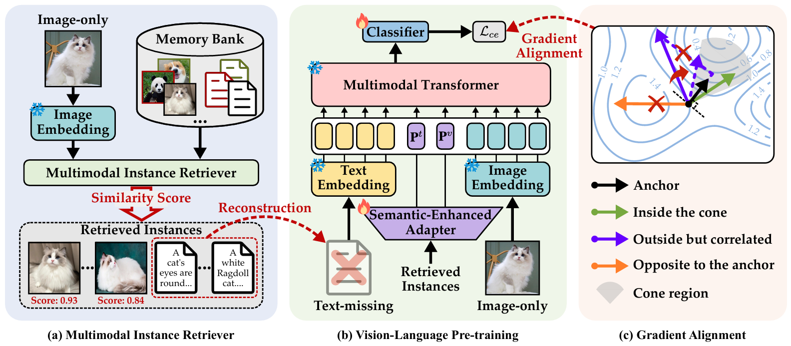

# 面向不完整多模态学习的锚点引导梯度对齐（ANGA）

本仓库是 CVPR 2026 收录论文 _Anchor-Guided Gradient Alignment for Incomplete Multimodal Learning_（面向不完整多模态学习的锚点引导梯度对齐）的官方实现。

## 摘要

视觉-语言预训练（Vision-Language Pre-training，VLP）在众多多模态学习（Multimodal Learning，MML）任务中取得了卓越的性能。近年来，许多工作致力于重建缺失模态，以提升 VLP 模型在不完整多模态场景下的适应能力。然而，这些方法忽视了严重缺失模态条件下的**学习不平衡**问题——即优化过程被重建样本所主导，从而削弱了完整样本的表征质量。在本文中，我们提出了一种新颖的 **ANGA（ANchor-guided Gradient Alignment，锚点引导的梯度对齐）** 框架来解决这一问题。具体而言，我们首先检索相似实例来重建缺失模态，从而缓解信息缺失；随后引入一种**熵驱动课程**，将可靠的重建样本与完整样本逐步融合，形成一个优化锚点，以此引导梯度对齐，缓解学习不平衡；此外，我们还设计了一个**语义增强适配器**，利用检索到的实例生成动态提示（dynamic prompts），进一步增强 VLP 模型的鲁棒性。在广泛使用的数据集上进行的大量实验表明，ANGA 在各种缺失模态场景下均优于当前最先进（SOTA）的基线方法。

## 框架



## 环境配置

首先，为 ANGA 创建一个新的 conda 环境：

```shell
conda create -n ANGA python=3.9
```

接着，激活该环境并从 `requirements.txt` 安装依赖：

```shell
conda activate ANGA

pip install -r requirements.txt
```

## 数据准备

### MM-IMDb

首先，从以下链接下载数据集：https://archive.org/download/mmimdb/mmimdb.tar.gz

然后，将原始图像放入 **dataset/mmimdb/image** 文件夹，并将 json 文件放入 **dataset/mmimdb/meta_data** 文件夹。

### HateMemes

首先，从以下链接下载数据集：https://www.kaggle.com/datasets/parthplc/facebook-hateful-meme-dataset

然后，将原始图像放入 **dataset/hatememes/image** 文件夹，并将 json 文件放入 **dataset/hatememes/metadata** 文件夹。

接着，将 metadata 中的 **test.json** 替换为从以下链接下载的 **test_seen.json**：https://www.kaggle.com/datasets/williamberrios/hateful-memes（因为前一个网站下载的 test.json 缺少用于评估的标签信息）。（不要改动其他文件，只需用 test_seen.json 替换 test.json）

### Food101

首先，从以下链接下载数据集：https://www.kaggle.com/datasets/gianmarco96/upmcfood101

然后，将原始图像放入 **dataset/food101/image** 文件夹，并将 csv 文件放入 **dataset/food101/meta_data** 文件夹。

注意：图像文件夹遵循结构 `dataset/xxx/image/xxx.jpg|png|jpeg`

## 代码运行

### 数据集初始化

以 HateMemes 数据集为例，运行以下命令初始化数据集：

```shell
python src/init_data.py
```

### 训练与评估

运行以下命令来训练我们的模型并评估结果：

```shell
python src/train.py
```

## 引用

如果您觉得本代码对您的研究有帮助，请给我们点亮 ⭐⭐⭐，并考虑引用：

```
@inproceedings{guan2026anchorguided,
    author = {Zhi{-}Hao Guan and
                  Longfei Huang and
                  Yang Yang},
    booktitle = {CVPR},
    year = {2026},
    title = {Anchor-Guided Gradient Alignment for Incomplete Multimodal Learning}
}
```
